# オープンMESプロジェクトのクラス構造

以下に、open-mes-projectリポジトリ全体のクラス図と各クラスの説明を示します。プロジェクトはDjangoフレームワークを用いており、ユーザー認証用のカスタムユーザーモデルや、製造業務に関するドメインモデル（在庫、購買、生産計画など）が定義されています。クラス図には主要なクラス名、プロパティ（フィールド）およびメソッド、そしてクラス間の継承・関連関係（例えば外部キーによる関連）を示しています。パッケージ（Djangoアプリ）ごとにクラスを整理してあり、継承関係は実線の三角矢印、関連（アソシエーション）は実線でカードinality（多重度）付きの線で表現しています。

## クラス図

```mermaid
classDiagram
%% Users module
class CustomUser {
    +user_id: string
    +email: string
    +is_staff: bool
    +is_active: bool
    +date_joined: datetime
    +objects: UserManager
}
class UserManager {
    +create_user(...)
    +create_superuser(...)
}
CustomUser --|> AbstractBaseUser
CustomUser --|> PermissionsMixin

%% Master (Master data) module
class Item {
    +name: string
    +code: string
    +item_type: string
    +unit: string
    +description: text
    +created_at: datetime
}
class Supplier {
    +name: string
    +contact_person: string
    +phone: string
    +email: string
    +address: text
    +created_at: datetime
}
class Warehouse {
    +id: UUID
    +warehouse_number: string
    +name: string
    +location: string
}

%% Inventory module
class Inventory {
    +id: UUID
    +quantity: int
    +reserved: int
    +location: string
    +last_updated: datetime
    +is_active: bool
    +is_allocatable: bool
    +available_quantity(): int
}
class StockMovement {
    +id: UUID
    +movement_type: string
    +quantity: int
    +timestamp: datetime
    +description: text
}
class PurchaseOrder {
    +id: UUID
    +order_number: string
    +quantity: int
    +received_quantity: int
    +order_date: datetime
    +expected_arrival: datetime
}
%% SalesOrder is in Production module but represents customer orders
class SalesOrder {
    +item: Item
    +warehouse: Warehouse
    +order_date: datetime
    +quantity: int
}
%% Production module
class ProductionPlan {
    +id: UUID
    +plan_name: string
    +product_code: string
    +planned_quantity: int
    +planned_start_datetime: datetime
    +planned_end_datetime: datetime
    +actual_start_datetime: datetime
    +actual_end_datetime: datetime
    +status: string
    +remarks: text
    +created_at: datetime
    +updated_at: datetime
}
class PartsUsed {
    +id: UUID
    +part_code: string
    +quantity_used: int
    +used_datetime: datetime
    +remarks: text
    +created_at: datetime
    +updated_at: datetime
}
class MaterialAllocation {
    +id: UUID
    +material_code: string
    +allocated_quantity: int
    +allocation_datetime: datetime
    +status: string
    +remarks: text
    +created_at: datetime
    +updated_at: datetime
}
class WorkProgress {
    +id: UUID
    +process_step: string
    +start_datetime: datetime
    +end_datetime: datetime
    +quantity_completed: int
    +status: string
    +remarks: text
    +created_at: datetime
    +updated_at: datetime
}
%% Relationships (associations)
Item "1" -- "0..*" Inventory : item
Warehouse "1" -- "0..*" Inventory : warehouse
Item "1" -- "0..*" StockMovement : item
Item "1" -- "0..*" PurchaseOrder : item
Supplier "1" -- "0..*" PurchaseOrder : supplier
Warehouse "1" -- "0..*" PurchaseOrder : warehouse
Item "1" -- "0..*" SalesOrder : item
Warehouse "1" -- "0..*" SalesOrder : warehouse
ProductionPlan "1" -- "0..*" PartsUsed : production_plan
ProductionPlan "1" -- "0..*" MaterialAllocation : production_plan
ProductionPlan "1" -- "0..*" WorkProgress : production_plan
CustomUser "1" -- "0..*" WorkProgress : operator
```

上記クラス図に基づき、各クラスの役割と主要な関係について以下に説明します。

## Users（ユーザー）モジュール

**CustomUser** – Django組み込みの認証用`AbstractBaseUser`および`PermissionsMixin`を継承したカスタムユーザークラスです (github.com)。このクラスはユーザーIDやメールアドレス、スタッフフラグ、アクティブフラグ、登録日時などのフィールドを持ちます。特に`user_id`（ユーザーID）を認証に用いるよう設計されており（当初はメールアドレスでのログインでしたがユーザーIDに変更されています）、`is_staff`や`is_active`でユーザーの権限状態を管理します。またDjangoの標準に従い、`objects`にカスタムマネージャとして`UserManager`を割り当てています (github.com)。`UserManager`では`create_user()`や`create_superuser()`メソッドを実装し、ユーザー作成処理を提供します。

## Master（マスターデータ）モジュール

**Item（品目）** – 製品や原材料を表すマスターデータのクラスです。`name`（名称）、`code`（コード）はユニーク制約付きで、それぞれ品目名と品目コードを表します (github.com)。`item_type`フィールドで「product（製品）」か「material（材料）」かを区別しており、その選択肢が定義されています (github.com github.com)。また、`unit`（単位）や`description`（説明）、作成日時`created_at`を持ちます。Itemは在庫や注文など他の多くのクラスから参照される中心的存在です。

**Supplier（仕入先）** – サプライヤー（部品・材料の供給元）を表すマスタークラスです。`name`（名前）、`contact_person`（担当者）、`phone`（電話番号）、`email`（メールアドレス）、`address`（住所）といった連絡先情報のフィールドを持ちます (github.com github.com)。加えて`created_at`（登録日時）を保持します。Supplierは`PurchaseOrder`（発注）から参照され、発注先企業の情報として使われます。

**Warehouse（倉庫）** – 製品や材料の保管場所を表すマスタークラスです。`warehouse_number`（倉庫番号）と`name`（名称）で倉庫を識別し、`location`（所在地等任意情報）を持ちます (github.com github.com)。主キー`id`にはUUIDが使用されます (github.com)。Warehouseは`Inventory`や`PurchaseOrder`、`SalesOrder`から参照され、在庫や入出庫の拠点を示します。

## Inventory（在庫）モジュール

**Inventory（在庫）** – 各品目の在庫状況を表すクラスです。特定の`Item`と`Warehouse`の組み合わせごとにレコードが存在し、`quantity`（現在庫数量）と`reserved`（引当済み数量）を持ちます (github.com github.com)。在庫の保管場所詳細として`location`（棚番など任意文字列）も保持します (github.com)。`last_updated`で最終更新日時を記録し、`is_active`（有効な在庫か）および`is_allocatable`（引当可能か）のフラグがあります (github.com github.com)。これらにより、在庫が無効化されている場合や引当禁止の場合を管理します。さらに`available_quantity`というプロパティが定義されており、`quantity - reserved`の計算結果を返すことで「実際に利用可能な在庫数」を取得できます（在庫が無効または非引当の場合は0を返します） (github.com github.com)。Inventoryは`Item`と`Warehouse`への外部キーを持ち（それぞれnull許可、削除時はSET_NULLとCASCADE） (github.com)、品目ごとの各倉庫在庫を管理します。

**StockMovement（在庫移動）** – 在庫の入出庫や使用履歴を記録するクラスです。在庫変動のタイプとして`MOVEMENT_TYPE_CHOICES`に「incoming（入庫）」「outgoing（出庫）」「used（生産で使用）」の選択肢が定義されており (github.com github.com)、`movement_type`フィールドでその種別を表します (github.com)。また、対象の`item`（品目） (github.com)、数量`quantity`、発生時刻`timestamp`（自動登録）を持ち、`description`に任意の備考を記録できます (github.com github.com)。`StockMovement`は`Item`に外部キーで紐づき、どの品目の在庫が増減したかを示します。ただし関連する`Warehouse`情報はこのモデルに直接は保持されていないため、倉庫ごとの入出庫履歴は必要に応じて他情報と突合せて管理します。

**PurchaseOrder（発注）** – サプライヤーへの発注情報を表すクラスです。`order_number`（発注番号）がユニークキーとして設定され (github.com)、発注先の`supplier`（`Supplier`へのFK）と発注対象の`item`（`Item`へのFK）を持ちます (github.com)。`quantity`（発注数量）および実際に受け入れた数量`received_quantity`を保持し、発注日`order_date`（自動現在日時）と期待納期`expected_arrival`（任意）があります (github.com github.com)。さらに、どの倉庫に入庫する予定かを示す`warehouse`（`Warehouse`へのFK）も持ちます (github.com)。`PurchaseOrder`は`Supplier`と`Item`に対する多対一の関連を持ち、`Warehouse`とも紐づいて、「ある仕入先への特定品目の発注」と「入庫予定先倉庫」を関連付けています。

## Production（生産）モジュール

**SalesOrder（受注）** – 顧客からの受注（生産すべき製品の注文）を表すクラスです。実装上はProductionアプリ内に定義されています。`SalesOrder`には`item`（受注製品、`Item`へのFK）および`warehouse`（出荷元倉庫、`Warehouse`へのFK）を持ちます (github.com)。これにより「どの製品をどの倉庫から出荷するか」が決まります。ただし現段階では数量や顧客情報といった詳細は保持していません。受注数量については後述の`ProductionPlan`側で管理され、`SalesOrder`自体は主に製品と出荷拠点の情報に留まっています。また、設計上は`Product`という別モデルを作成して製品情報を管理する計画があり、コード中に「master.Productモデルが定義されたらForeignKeyに変更する」とのコメントがあります (github.com)。現状では`Product`モデルが未実装のため、`SalesOrder`や`ProductionPlan`では製品を直接`Item`で参照する形になっています。

**ProductionPlan（生産計画）** – 製造指示・生産計画を表すクラスです。生産計画ごとにレコードがあり、UUIDの`id`で識別されます。`plan_name`（計画名）や製造する製品を示す`product_code`（製品コード）があり、製品コードについては先述のとおり本来は`Product`モデルへのFKにする予定で現在は文字列で仮置きされています (github.com)。`planned_quantity`（計画数量）、計画開始・終了日時（`planned_start_datetime`, `planned_end_datetime`）、実績の開始・終了日時（`actual_start_datetime`, `actual_end_datetime`）を持ち、進捗ステータス`status`も管理します (github.com github.com)。ステータスは「未着手(PENDING)」「進行中(IN_PROGRESS)」「完了(COMPLETED)」「保留(ON_HOLD)」「中止(CANCELLED)」などの選択肢から設定されます (github.com github.com)。備考`remarks`欄もあり、各種日時や数量、ステータス、備考から生産の計画と実績を詳細に記録します (github.com github.com)。`ProductionPlan`は`SalesOrder`と一対一対応（コード上は直接のFKは無いものの、通常は各受注に対して一つの生産計画が紐づく想定）で、`ProductionPlan`の`planned_quantity`等に受注量が反映されます。

**PartsUsed（使用部品）** – 生産計画において使用された部品の記録を表すクラスです。ある`ProductionPlan`に対し、使用した部品ごとにレコードが作られます。`production_plan`フィールドでどの生産計画に属するかを示し（`ProductionPlan`へのFK、関連名`parts_used`） (github.com)、`part_code`で部品コード（こちらも将来的には`master.Part`モデルへのFKに置き換える予定）を保持します (github.com)。また`quantity_used`（使用数量）と`used_datetime`（使用日時）を記録し、備考`remarks`も残せます (github.com github.com)。作成・更新日時（`created_at`, `updated_at`）も含め、生産で消費された部品の履歴管理に用いられます。`PartsUsed`からは`ProductionPlan`に多対一で関連し、`ProductionPlan`側から関連名`parts_used`で複数の`PartsUsed`を参照できます。

**MaterialAllocation（材料引当）** – 生産計画に対して原材料を引き当てた（取り置きした）情報を表すクラスです。`production_plan`フィールド（`ProductionPlan`へのFK、関連名`material_allocations`）でどの生産計画向けかを示します (github.com)。`material_code`に引当材料のコード（将来的には`master.Material`モデルへのFK予定）を保持し (github.com)、`allocated_quantity`（引当数量）と`allocation_datetime`（引当日時）を記録します (github.com github.com)。さらに`status`で「引当済(ALLOCATED)」「出庫済(ISSUED)」「返却済(RETURNED)」といった状態を管理します (github.com github.com)。`remarks`欄や作成・更新日時も備え、生産に必要な材料がどれだけ確保され、その後出庫されたか等のライフサイクルを追跡できます。`MaterialAllocation`も`ProductionPlan`に対し多対一の関連で、`ProductionPlan`側から`material_allocations`として参照されます。

**WorkProgress（作業進捗）** – 現場の作業進行状況を記録するクラスです。`ProductionPlan`に対する実行中の工程ステップを表し、`production_plan`フィールドで紐づく生産計画（FK、関連名`work_progresses`）を持ちます (github.com)。`process_step`（工程名/ステップ名）には例として「組立」「塗装」「検査」など工程を示す文字列を入れます (github.com)。`operator`フィールドは作業担当者で、これはカスタムユーザー（`CustomUser`）へのFKになっており、作業者が削除された場合はNULLとなるよう設定されています（`on_delete=models.SET_NULL`） (github.com)。また開始・終了日時（`start_datetime`, `end_datetime`）、完了数量`quantity_completed`、ステータス`status`（進捗状態。「未開始(NOT_STARTED)」「進行中(IN_PROGRESS)」「完了(COMPLETED)」「一時停止(PAUSED)」から選択）を持ちます (github.com github.com github.com)。備考`remarks`や自動記録の作成・更新日時も含め、作業の実績データを詳細に保存します。`WorkProgress`は`ProductionPlan`に対して多対一で複数存在しうる他、`Operator`（`CustomUser`）とも多対一の関係です。一人のユーザーが複数の作業進捗を担当しうることになります。

## Machine（機械）モジュール

Machineモジュールは製造設備や機械に関する管理を行う目的で用意されていますが、2025年5月時点でこのモジュールに実装されたモデルクラスはありません（`MachineConfig`のみが存在）。将来的には機械情報（例えば機械ID、稼働状態、メンテナンス記録等）を扱うクラスが追加される予定です。

## Quality（品質）モジュール

Qualityモジュールもまた現在のところモデルクラスが未実装の状態です（`QualityConfig`のみ定義）。品質検査や不良管理などを行うためのモジュールで、今後品質チェック結果や検査項目を扱うクラスが追加される計画と思われます。実際、プロジェクト開始時にQualityアプリは作成されておりマイグレーションも実行可能ですが（READMEの手順に含まれる）、2025年5月時点で対応するモデルは用意されていません。

## その他補足

**継承関係**: 全てのモデルクラス（Djangoアプリのモデル）は暗黙的に`django.db.models.Model`を継承しています。図では煩雑さを避けるため`Model`基底クラスとの継承関係は省略していますが、例えば`Inventory`や`Item`などは`Model`のサブクラスです。また`CustomUser`は前述の通りDjangoの`AbstractBaseUser`と`PermissionsMixin`を継承しており (github.com)、これによってパスワード管理や権限管理の機能を利用しています。

**関連関係**: モデル間の主な関連は上図の通りです。Masterデータ（`Item`, `Supplier`, `Warehouse`）は他モジュールから参照される側として“一対多”の関連を持ちます。例えば`Item`は在庫`Inventory`、在庫履歴`StockMovement`、発注`PurchaseOrder`、受注`SalesOrder`など複数のクラスから参照されます (github.com github.com)。また`ProductionPlan`を中心に、生産計画と各種リソース（使用部品、材料引当、作業進捗）が一対多で関連付けられています (github.com github.com github.com)。`WorkProgress`と`CustomUser`（Operator）は「ユーザー1人に対し複数の作業進捗」という関係です (github.com)。これら関連により、オープンMESは「マスターデータ – 在庫/発注 – 生産計画 – 実績」という階層構造でデータを組み合わせ、製造実行システムとして機能しています。

---

## Sources

本クラス図および説明はGitHubリポジトリ上の公開ソースコードに基づいており、各クラスの定義やフィールドは実装時点のコードに準拠しています (github.com github.com github.com)。今後の開発により変更される可能性もありますが、2025年5月現在の最新版におけるクラス構造を網羅的に示しました。

- open-mes-project リポジトリのソースコード（GitHub）(github.com, github.com, github.com, github.com など) (2025年5月30日参照)